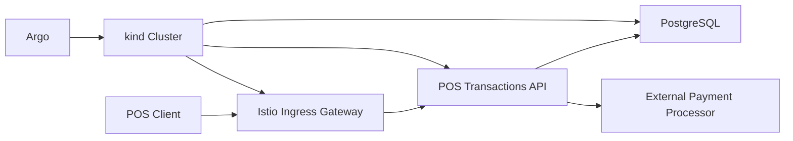
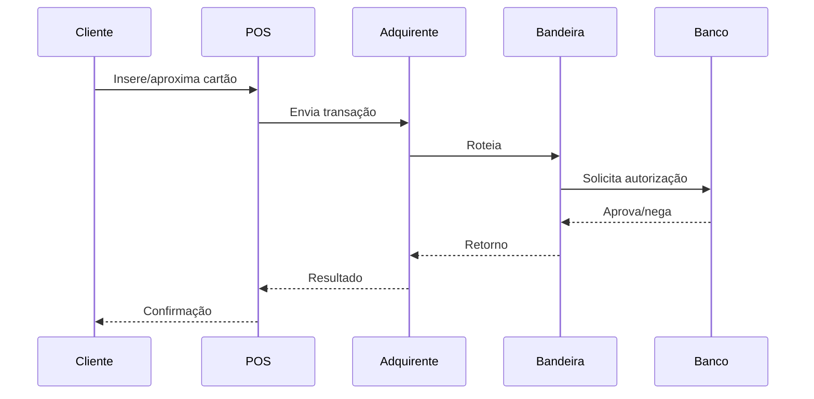

# POS Transactions - SDD First Template

Este projeto foi estruturado seguindo SDD (Solution Design Document) antes da implementação.

## Objetivo
Definir claramente decisões arquiteturais antes de gerar código com Codex.

## Plataforma
- Java 21 + Spring Boot 3
- PostgreSQL como source of truth
- `kind` como Kubernetes local
- `Argo` para fluxo de entrega e deploy
- `Istio` para service mesh
- `Prometheus` + `Grafana` para observabilidade
- `Flagsmith` para feature flags e A/B tests

## Arquitetura


## Qualidade
- Todo commit deve validar cobertura minima de 80% nas linhas Java alteradas
- Toda nova implementação deve manter cobertura mínima de 80%
- Toda mudança deve passar em `mvn test`
- Toda mudança deve passar na regressão `k6`
- Toda mudança deve passar no `k6` de carga e segurança
- Os dashboards `k6` devem ser exportados para `perf/k6/reports`
- Toda mudança deve preservar dashboards de aplicação, mesh e experimentos

## Rodar local
### Pré-requisitos
- Java 21
- Maven
- Docker Desktop
- `k6` opcional

### Subir tudo
No Windows:

```bat
run-local.bat
```

Esse script sobe:
- PostgreSQL em `localhost:5432`
- Mock do processador externo em `http://localhost:8081`
- API Spring Boot em `http://localhost:8080`
- Prometheus em `http://localhost:9090`
- Grafana em `http://localhost:3000` com `admin/admin`
- Tempo em `http://localhost:3200`

## Kubernetes Local
### Subir `kind` + `Istio` + `Argo CD`
```bat
run-kind-platform.bat
```

Esse script:
- cria o cluster `kind-poc-pos`
- instala `Istio`
- expõe o ingress gateway em `http://localhost:8088`
- instala `Argo CD`
- faz build da imagem `poc-pos:kind`
- carrega a imagem no cluster
- aplica os manifests em `infra/k8s/overlays/local-kind`

### Acessar a API via `Istio`
Use o mesmo HMAC, mas apontando para:

```text
http://localhost:8088
```

### Acessar o `Argo CD`
Em outro terminal:

```bat
port-forward-argocd.bat
```

Depois abra:

```text
https://localhost:8089
```

Usuário:
- `admin`

Senha inicial:

```powershell
$pwd = kubectl -n argocd get secret argocd-initial-admin-secret -o jsonpath="{.data.password}"
[Text.Encoding]::UTF8.GetString([Convert]::FromBase64String($pwd))
```

### Bootstrap do `Application` no `Argo CD`
Como este workspace ainda não está em um repositório Git remoto, o `Argo CD` já sobe pronto, mas o sync GitOps só pode ser ligado depois que existir uma URL Git para os manifests.

Quando houver um repositório remoto:

```powershell
.\bootstrap-argocd-app.ps1 -RepoUrl https://github.com/seu-org/seu-repo.git -TargetRevision main
```

O template usado fica em `infra/argocd/pos-application-template.yaml`.

### Derrubar o cluster local
```bat
stop-kind-platform.bat
```

### Derrubar tudo
```bat
stop-local.bat
```

### Rodar testes unitários e de integração
```bat
mvn test
```

### Validar cobertura das mudancas antes do commit
O repositorio usa um `pre-commit` versionado em `.githooks/pre-commit`.

Para ativar o hook localmente:

```powershell
git config core.hooksPath .githooks
```

No commit, o hook executa `mvn test jacoco:report` e bloqueia a operacao se as linhas Java alteradas e staged tiverem menos de 80% de cobertura.

### Regressão com dashboard k6
```bat
run-k6-regression.bat
```

Dashboard:
- `http://localhost:5665`
- export HTML em `perf/k6/reports/regression-dashboard.html`

### Carga e security/pentest com dashboard k6
```bat
run-k6-security.bat
```

Dashboard:
- `http://localhost:5666`
- export HTML em `perf/k6/reports/security-dashboard.html`

### Simulacao MITM e replay com dashboard k6
```bat
run-k6-mitm.bat
```

Dashboard:
- `http://localhost:5667`
- export HTML em `perf/k6/reports/mitm-dashboard.html`

### Pipeline local obrigatório para cada mudança
Com a API em execução:

```bat
verify-all.bat
```

Se a API estiver em outra porta, passe a URL base:

```bat
verify-all.bat http://localhost:8082
```

Esse comando executa:
1. `mvn test`
2. health check da API
3. regressão `k6`
4. `k6` de carga e segurança

## Observabilidade
- Prometheus coleta métricas da API em `/actuator/prometheus`
- Grafana sobe provisionado com datasource de `Prometheus` e `Tempo`
- O dashboard `POS Service Health and Scaling` mostra instâncias saudáveis, throughput, RPM por instância, p95, CPU, heap, pool JDBC, bulkhead, circuit breaker, outcomes de negócio, duração média por etapa e tráfego do `Istio`
- O dashboard `POS Trace Analysis` compara duração por operação e etapa, separa por `feature_variant` e traz receitas de busca no `Tempo` por `traceId` e `correlation_id`
- Métricas de negócio usam `operation`, `outcome` e `feature_variant`
- Traces OTLP ficam disponíveis no `Tempo`, com spans por `usecase`, `lookup`, `payment_processor`, `domain_transition`, `persist` e `reread_on_conflict`
- O objetivo é acompanhar throughput por minuto, taxa de erro, latência e distribuição por experimento

## Istio
- O Prometheus local já possui jobs preparados para `istio-proxy` e `istiod`
- Em ambiente com `Istio`, o Grafana deve mostrar tráfego por minuto, response codes e comportamento da mesh
- O ambiente `kind` local expõe a API via `Istio Ingress Gateway` em `http://localhost:8088`

## Argo CD
- O `Argo CD` é instalado no namespace `argocd`
- O acesso local é feito com `port-forward-argocd.bat`
- O `Application` GitOps é bootstrapado via `bootstrap-argocd-app.ps1`
- O sync automático depende de uma URL Git remota, porque este diretório ainda não é um repositório Git

## Feature flags e A/B
- O header `X-Feature-Variant` representa a variante resolvida pelo `Flagsmith`
- As métricas de negócio são emitidas com o label `feature_variant`
- O dashboard do Grafana compara `control` e `treatment`
- Referência detalhada em `docs/007-feature-flags-and-ab-tests.md`

### Testar authorize com HMAC
```powershell
.\invoke-authorize-local.ps1
```

### Teste E2E de MITM e replay no Maven
```bat
mvn -Dtest=HmacMitmE2ETest test
```

Esse teste cobre:
- adulteracao de payload no caminho com assinatura calculada sobre o corpo original
- replay da mesma requisicao assinada dentro da janela permitida

Agora o replay deve ser rejeitado com `401`, mesmo quando a assinatura e o payload sao validos.

### Chamada manual de health
```powershell
Invoke-WebRequest http://localhost:8080/actuator/health
```

### Chamada manual de métricas
```powershell
Invoke-WebRequest http://localhost:8080/actuator/prometheus
```



