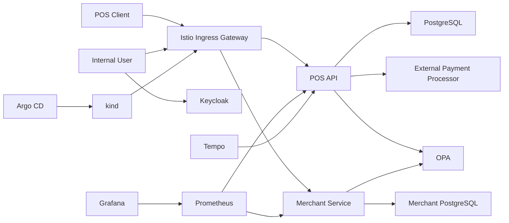
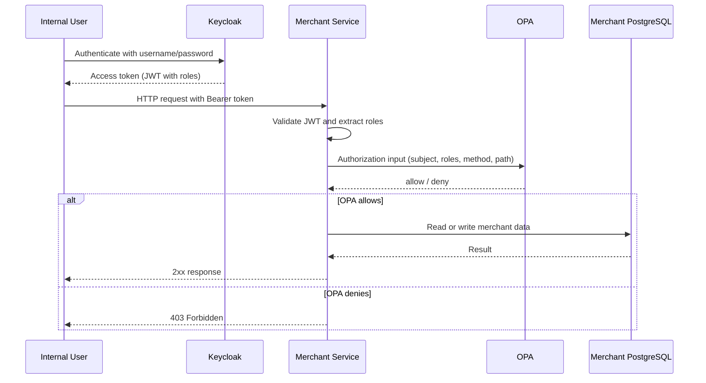

# POS Transactions Platform

Este projeto segue SDD primeiro e agora contempla duas trilhas:
- `pos-api` para transações POS com HMAC e proteção contra replay
- `merchant-service` para cadastro administrativo com IdP, RBAC e OPA

## Plataforma
- Java 21 + Spring Boot 3
- PostgreSQL
- Keycloak como IdP OIDC
- OPA para autorização fina
- `kind` como Kubernetes local
- `Argo`, `Istio`, `Prometheus`, `Grafana`, `Tempo`

## Arquitetura


## Sequence Diagram


## Rodar local
### Pré-requisitos
- Java 21
- Maven
- Docker Desktop
- `k6` opcional

### Subir stack completa
```bat
run-local.bat
```

Sobe:
- PostgreSQL em `localhost:5432`
- Merchant PostgreSQL em `localhost:5433`
- mock do processador externo em `http://localhost:8081`
- Keycloak em `http://localhost:8180`
- OPA em `http://localhost:8181`
- Merchant Service em `http://localhost:8083`
- POS API em `http://localhost:8080`
- Prometheus em `http://localhost:9090`
- Grafana em `http://localhost:3000`
- Tempo em `http://localhost:3200`

### Subir apenas identidade e cadastro
```bat
run-merchant-local.bat
```

### Derrubar tudo
```bat
stop-local.bat
```

## Testes
### POS API
```bat
mvn test
```

### Merchant Service
```bat
mvn -f merchant-service/pom.xml test
```

### Verificação local completa
```bat
verify-all.bat
```

Esse comando executa:
1. `mvn test`
2. `mvn -f merchant-service/pom.xml test`
3. health check da POS API
4. regressão `k6`
5. `k6` de carga e segurança

## Segurança POS
- HMAC com `X-Timestamp`, `X-Correlation-Id` e `X-Signature`
- proteção contra replay
- teste MITM/replay:

```bat
run-k6-mitm.bat
```

## Identidade e Autorização
- realm: `poc-pos`
- client inicial: `merchant-service`
- usuários bootstrap:
  - `admin-user` / `admin123`
  - `operator-user` / `operator123`
  - `auditor-user` / `auditor123`
- roles:
  - `admin`
  - `operator`
  - `auditor`

### Política OPA inicial
- `GET /api/merchants` e `GET /api/merchants/{id}`:
  - `admin`
  - `operator`
  - `auditor`
- `POST /api/merchants`:
  - `admin`

### Obter token no Keycloak
```powershell
$body = @{
  client_id = "merchant-service"
  username = "admin-user"
  password = "admin123"
  grant_type = "password"
}

Invoke-RestMethod `
  -Method Post `
  -Uri "http://localhost:8180/realms/poc-pos/protocol/openid-connect/token" `
  -Body $body
```

### Chamar o Merchant Service
```powershell
$token = "<jwt>"

Invoke-WebRequest `
  -Uri "http://localhost:8083/api/merchants" `
  -Method Get `
  -Headers @{ Authorization = "Bearer $token" }
```

### Criar merchant como admin
```powershell
$token = "<jwt>"
$body = '{"merchantId":"m-1","legalName":"Store 1","documentNumber":"12345678901"}'

Invoke-WebRequest `
  -Uri "http://localhost:8083/api/merchants" `
  -Method Post `
  -Headers @{
    Authorization = "Bearer $token"
    "Content-Type" = "application/json"
  } `
  -Body $body
```

### Smoke test automático com token real
```powershell
powershell -NoProfile -ExecutionPolicy Bypass -File scripts/test-merchant-auth.ps1 -ApiBaseUrl http://localhost:8083 -IdpBaseUrl http://localhost:8180
```

## Kubernetes local
### Subir `kind` + `Istio` + `Argo CD`
```bat
run-kind-platform.bat
```

### Derrubar cluster
```bat
stop-kind-platform.bat
```

### Bootstrap do `Application` no `Argo CD`
```powershell
.\bootstrap-argocd-app.ps1 -RepoUrl https://github.com/seu-org/seu-repo.git -TargetRevision main
```

### Smoke test do `merchant-service` via ingress local
```powershell
powershell -NoProfile -ExecutionPolicy Bypass -File scripts/test-merchant-auth.ps1
```

## Observabilidade
- métricas da POS API em `/actuator/prometheus`
- dashboards do Grafana em `infra/grafana/dashboards`
- traces OTLP via `Tempo`

## Referências
- SDD: `docs/001-sdd-pos-transactions.md`
- contrato: `docs/002-api-contract.md`
- NFR: `docs/005-nfr-resilience-security-observability.md`
