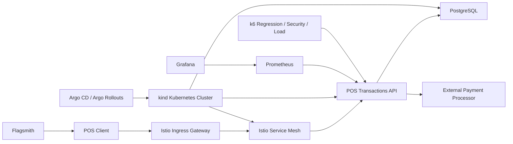

# SDD - POS Transactions API

## Contexto
API síncrona para processar transações POS.
Execução alvo em Kubernetes local com `kind`, entrega contínua com `Argo` e service mesh com `Istio`.

## Objetivos
- Idempotência distribuída
- Alta confiabilidade
- Sem estado em memória local
- Cobertura mínima de 80% para cada nova implementação
- Toda mudança deve passar em toda a suíte automatizada antes de seguir
- Observabilidade obrigatória desde o início da implementação

## Requisitos
- authorize
- confirm
- void

## Decisões
- PostgreSQL como source of truth
- Unique `(terminal_id, nsu)`
- `transactionId` único global
- State machine simples
- `kind` como ambiente Kubernetes local
- `Argo` para deploy e promoção
- `Istio` como service mesh
- `k6` para regressão, carga e testes de segurança
- `Prometheus` + `Grafana` para métricas e dashboards
- `Flagsmith` para experimentação e feature flags
- manifests Kubernetes versionados em `infra/k8s`
- `Argo CD` como reconciliador dos manifests do ambiente

## Estados
- AUTHORIZED
- CONFIRMED
- VOIDED

## Riscos
- corrida entre pods
- duplicidade externa
- regressão funcional após mudanças
- degradação sob carga ou tráfego malicioso
- baixa visibilidade operacional

## Mitigações
- constraint única
- retry controlado
- circuit breaker
- bulkhead
- validação HMAC com timestamp, correlationId e bloqueio de replay
- reread on conflict após violação da unique constraint
- suíte `k6` com dashboard
- execução obrigatória de `mvn test` + regressão `k6` + security/load `k6`
- monitoramento por aplicação, mesh e feature variant

## Exigências de Observabilidade
- expor `/actuator/prometheus`
- publicar métricas de negócio por `operation`, `outcome` e `feature_variant`
- medir throughput por minuto, taxa de erro, latência e volume por operação
- ter dashboards no `Grafana` para aplicação, A/B test e tráfego `Istio`
- ter scraping via `Prometheus`
- permitir análise de `control` x `treatment`
- toda mudança relevante de fluxo deve refletir nas métricas e dashboards
- permitir operação local em `kind` com deploy via `Istio Ingress Gateway`
- preparar `Application` do `Argo CD` para reconciliar o overlay Kubernetes do ambiente local

## Arquitetura

