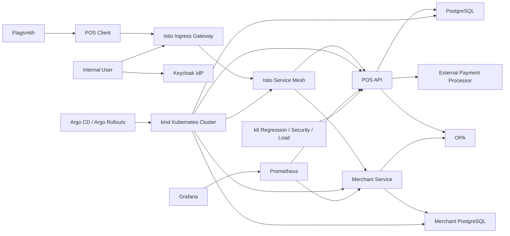

# SDD - POS Transactions Platform

## Contexto
Plataforma síncrona para processar transações POS e operar cadastros administrativos.
Execução alvo em Kubernetes local com `kind`, entrega contínua com `Argo` e service mesh com `Istio`.

## Objetivos
- idempotência distribuída
- alta confiabilidade
- sem estado em memória local como fonte de verdade
- autenticação centralizada de usuários
- autorização auditável por role e política
- cobertura mínima de 80% para cada nova implementação
- toda mudança deve passar em toda a suíte automatizada antes de seguir
- observabilidade obrigatória desde o início da implementação

## Requisitos
- authorize
- confirm
- void
- autenticação federada de usuários via IdP
- autorização por RBAC
- autorização contextual via OPA
- microserviço dedicado para cadastro de merchants e terminais

## Decisões
- PostgreSQL como source of truth
- unique `(terminal_id, nsu)`
- `transactionId` único global
- state machine simples
- `Keycloak` como IdP OIDC para usuários internos
- JWT Bearer como credencial de acesso entre usuário e APIs protegidas
- RBAC baseado em roles do token (`admin`, `operator`, `auditor`)
- OPA como mecanismo de autorização fina por recurso e ação
- novo microserviço `merchant-service` para merchants, lojas e terminais
- `pos-api` permanece focada em transações
- `kind` como ambiente Kubernetes local
- `Argo` para deploy e promoção
- `Istio` como service mesh
- `k6` para regressão, carga e testes de segurança
- `Prometheus` + `Grafana` para métricas e dashboards
- `Flagsmith` para experimentação e feature flags
- manifests Kubernetes versionados em `infra/k8s`
- `Argo CD` como reconciliador dos manifests do ambiente

## Estados
- AUTHORIZED
- CONFIRMED
- VOIDED

## Riscos
- corrida entre pods
- duplicidade externa
- regressão funcional após mudanças
- degradação sob carga ou tráfego malicioso
- baixa visibilidade operacional
- autorização inconsistente entre serviços
- acoplamento excessivo entre transação e backoffice

## Mitigações
- constraint única
- retry controlado
- circuit breaker
- bulkhead
- validação HMAC com timestamp, correlationId e bloqueio de replay
- autenticação centralizada via IdP
- autorização coarse-grained via RBAC
- autorização fine-grained via políticas Rego no OPA
- reread on conflict após violação da unique constraint
- suíte `k6` com dashboard
- execução obrigatória de `mvn test` + regressão `k6` + security/load `k6`
- monitoramento por aplicação, mesh e feature variant

## Segurança e Identidade
- usuários internos autenticam no `Keycloak`
- `merchant-service` exige JWT emitido pelo IdP para todos os endpoints de negócio
- `pos-api` preserva HMAC para chamadas POS e adiciona suporte a JWT para endpoints administrativos
- RBAC mínimo:
  - `admin`: cadastro e administração completa
  - `operator`: consulta e manutenção operacional
  - `auditor`: somente leitura
- OPA decide permissões finais combinando:
  - role do usuário
  - recurso acessado
  - ação HTTP
  - atributos de domínio enviados pela API

## Microserviços
- `pos-api`
  - responsabilidade: authorize, confirm, void, HMAC, resiliência e observabilidade transacional
- `merchant-service`
  - responsabilidade: cadastro e consulta de merchants, lojas e terminais
  - segurança: JWT + RBAC + OPA
  - persistência: PostgreSQL próprio

## Sequência de Entrega da Expansão
1. provisionar IdP local e realm inicial
2. adicionar JWT resource server e RBAC
3. integrar OPA com políticas iniciais
4. criar `merchant-service`
5. integrar compose, k8s, docs e testes

## Exigências de Observabilidade
- expor `/actuator/prometheus`
- publicar métricas de negócio por `operation`, `outcome` e `feature_variant`
- medir throughput por minuto, taxa de erro, latência e volume por operação
- ter dashboards no `Grafana` para aplicação, A/B test e tráfego `Istio`
- ter scraping via `Prometheus`
- permitir análise de `control` x `treatment`
- toda mudança relevante de fluxo deve refletir nas métricas e dashboards
- permitir operação local em `kind` com deploy via `Istio Ingress Gateway`
- preparar `Application` do `Argo CD` para reconciliar o overlay Kubernetes do ambiente local

## Arquitetura

